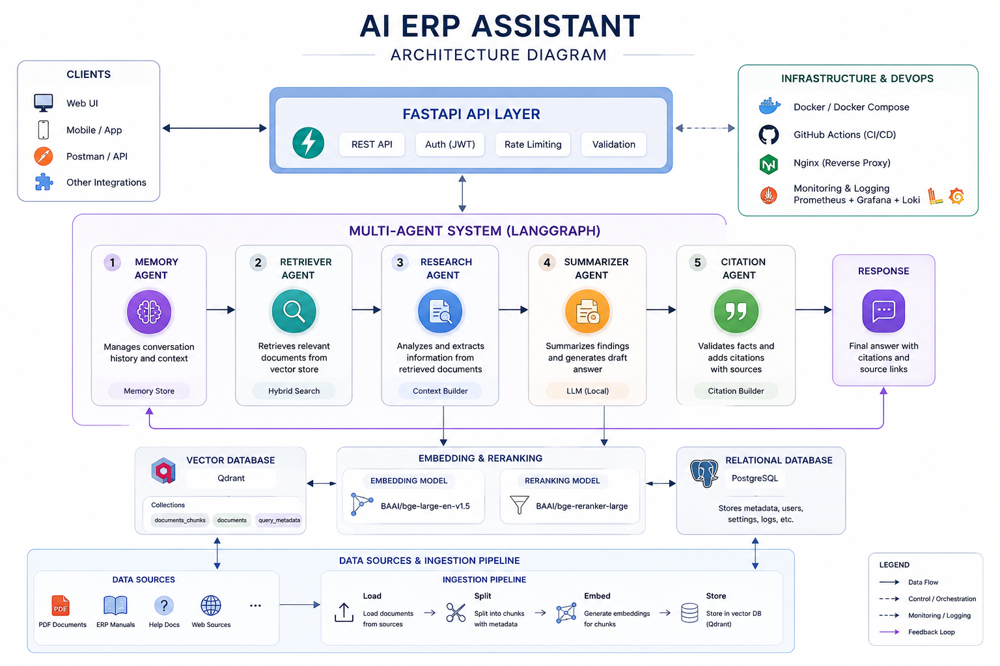

# AI ERP Assistant

> AI-powered ERP Assistant built with FastAPI, LangGraph, Ollama, Qdrant and Retrieval-Augmented Generation (RAG).

## Overview

AI ERP Assistant helps employees quickly find information from ERP documentation using local Large Language Models.

The system combines:

- Multi-Agent Architecture
- Retrieval-Augmented Generation (RAG)
- Local LLMs (Ollama)
- Vector Search (Qdrant)
- Conversation Memory
- PDF Knowledge Base

---

## Features

✅ Local LLM support

✅ Multi-Agent workflow

✅ FastAPI REST API

✅ PDF ingestion

✅ Semantic Search

✅ CrossEncoder reranking

✅ Conversation Memory

✅ Docker deployment

---

## Architecture


```

---

## Tech Stack

Python

FastAPI

LangGraph

Ollama

Qwen

Qdrant

Docker

PostgreSQL

Pytest

---

## Getting Started

```bash
docker compose up
```

---

## API

POST

/api/v1/chat

Example

```json
{
    "message":"How do I create a sales order?"
}
```

---

## Roadmap

- Authentication
- Streaming responses
- Hybrid Search
- UI
- MCP support
- Odoo Integration

---

## Screenshots

...

---

## Status

🚧 In Development